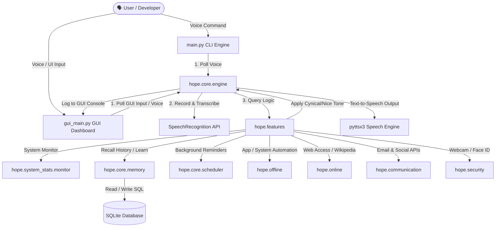

# 🌟 Project HOPE - Developer & Architecture Workflow

Welcome to the development workflow and architecture manual for **Project HOPE** (Human-Oriented Personal Engine). This document provides an exhaustive reference of the system's runtime pipelines, component mappings, testing procedures, and extension workflows.

---

## 🗺️ System Architecture

Project HOPE is built as a modular, local-first Python desktop assistant. Below is an architectural overview of how modules interact during a typical command execution life-cycle:



---

## 🗂️ Project Directory Mapping

Here is a breakdown of the repository structure and what each module manages:

| Directory/File | Description | Key Modules |
| :--- | :--- | :--- |
| **`hope/core/`** | Central orchestration & engine logic | `engine.py` (TTS, speech recognition, and personality selection), `memory.py` (database logs & preferences), `scheduler.py` (reminders) |
| **`hope/system_stats/`**| Low-level host monitoring | `monitor.py` (CPU, RAM, disk, battery, and network trackers) |
| **`hope/offline/`** | Offline PC automation tools | `apps.py` (volume control, window controls, and tool launching), `time_utils.py` (greeter and clocks) |
| **`hope/online/`** | Web services & online lookups | `browser.py` (searches), `knowledge.py` (Wikipedia scraper), `maps.py` (distance estimation and maps) |
| **`hope/communication/`**| Email and Messaging APIs | `email_handler.py` (IMAP/SMTP fallbacks), `gmail_api.py` (Gmail OAuth2), `whatsapp_handler.py` |
| **`hope/security/`** | OpenCV Vision systems | `face_recognition.py` (webcam face detection) |
| **`hope/gui/`** | Tkinter Graphical Dashboard | `dashboard.py` (sidebar metrics, log console, input console) |
| **`hope/configuration/`**| User settings & presets | `settings.py` (Master constants, thresholds, and personality prefix/suffix arrays) |
| **`tests/`** | Comprehensive unit test suite | Validation for memory, fuzzy matching, cynical engines, diagnostics, and scheduler |

---

## ⚙️ Core Runtime Pipelines

### 1. The Speech Execution Pipeline (CLI / GUI)
1. **Listening**: `takecmd()` runs in a continuous loop using the `speech_recognition` module.
2. **Filtering (Fuzzy Logic)**: The transcription text is filtered via `difflib.SequenceMatcher` in `hope/features.py` against standard command lists to auto-correct typos (e.g., "open yutube" -> "open youtube").
3. **Passive Diagnostics**: Prior to execution, `hope/system_stats/monitor.py` scans system health:
   - If CPU/RAM exceeds configured limits, HOPE interrupts to sarcastically warn the user.
   - If battery is critical and un-plugged, HOPE advises resting.
4. **Action Routing**: Valid commands trigger their respective subsystems (e.g., opening applications, sending an email, web scraping).
5. **Personality Layer**: The text response is passed to `apply_personality()`. Based on the current mode (`cynical` or `empathy`) and the user's `humor_level` setting (0–10), the response is decorated with random sassy prefixes/suffixes (e.g., Batman or sarcastic lines) and saved to long-term database memory.
6. **Delivery**: The finalized text is logged to the dashboard and spoken out loud via SAPI5/Pyttsx3.

---

## 🛠️ Typical Development Workflows

### Setup and Environment
Ensure you are using the correct dependencies and Python 3.13 configuration (we include a system patch for the `re` module templates in `main.py` and `gui_main.py`):
```bash
# Clone the repository
git clone https://github.com/Xavierfroster/hope.git
cd hope

# Activate virtual environment
venv\Scripts\activate

# Install required packages
pip install pyttsx3 SpeechRecognition pyautogui wikipedia opencv-python pyaudio psutil google-auth google-auth-oauthlib google-api-python-client regex
```

### Running the System
Project HOPE can be run in two distinct user interfaces:
- **CLI Mode**: Best for headless terminal debugging or pure voice control.
  ```bash
  python main.py
  ```
- **GUI Mode**: Minimalist CustomTkinter-styled dashboard showcasing system stats, logs, and a text command entry field.
  ```bash
  python gui_main.py
  ```

---

## 🧪 Testing Workflow

A robust test harness is provided to validate new logic without requiring hardware-specific speech recognition.

### Running Single-Component Tests
Test modules are structured to mock the pyttsx3 voice synthesis and Google speech transcription so they execute instantly in terminal shells.

> [!IMPORTANT]
> Because Python requires the parent package to be in the search path, always set `PYTHONPATH=.` when launching tests from the root directory.

```powershell
# Set path and run all tests in PowerShell
$env:PYTHONPATH="."
Get-ChildItem tests\test_*.py | ForEach-Object { python $_.FullName }
```

### Key Test Descriptions

1. **`test_diagnostics.py`**: Checks that high CPU, RAM, disk usage, or low battery thresholds dynamically trigger passive warning overrides before any normal command is executed.
2. **`tests/test_cynicism_logic.py`**: Validates the probability engine for sarcasm. At `humor_level = 10`, sarcasm is 100% guaranteed, while at `humor_level = 1`, it decreases to 10%.
3. **`tests/test_fuzzy_logic.py`**: Evaluates `difflib` mapping to make sure misspelled user intent successfully maps to exact feature functions.
4. **`tests/test_memory_recall.py`**: Validates the SQLite persistence engine. Evaluates recall commands (e.g., "how many times have I opened youtube?").

---

## 🤝 Feature Expansion Guide

To add a new skill to HOPE:
1. **Module Creation**: Put the logic under the appropriate namespace directory (e.g., `hope/online/` if it requires APIs, or `hope/offline/` for local tools).
2. **Expose Feature**: Import your logic into `hope/features.py`.
3. **Register Command**: Add your command's fuzzy trigger string to the `core_commands` list inside `execute_query(query)` in `hope/features.py`.
4. **Add Routing Block**: Add an `if` condition under "Command Routing" in `hope/features.py` to invoke your module's function.
5. **Create Unit Test**: Write a script under `tests/` that mocks voice interaction to thoroughly test the module.
